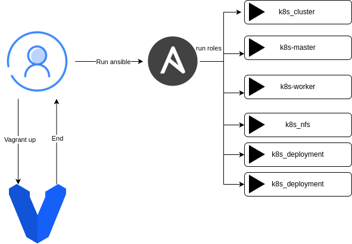
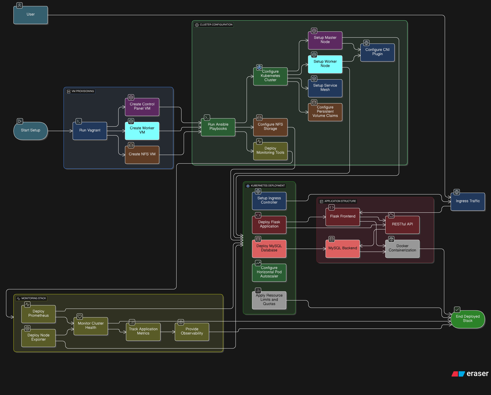

# k8s-flask-mysql-stack

## Overview

This project demonstrates a complete Kubernetes (k8s) stack featuring a Flask web application connected to a MySQL database. It provides a fully automated setup using Vagrant for virtual machines, Ansible for provisioning, and Kubernetes for orchestration. The stack includes monitoring capabilities with Prometheus, proper resource management, and follows infrastructure-as-code principles. The sample application is a task manager that showcases containerization best practices, database integration, RESTful API design, and scalable architecture - all deployable with minimal manual configuration.

### simple-architecture


This diagram illustrates the basic architecture of the Kubernetes cluster with Flask and MySQL components.

### high-detailed-architecture


## Prerequisites

- **Vagrant**: For managing virtual machines.
- **Ansible**: For automating the deployment of the Kubernetes cluster and applications.
- **Ansible Collections**: Ensure you have the necessary Ansible collections installed. You can install them using the following command:

```bash
ansible-galaxy collection install -r ansible/requirements.yml
```

## Project Structure

```bash
.
k8s-flask-mysql-stack/  # Root directory of the project
├── ansible/               # Ansible configuration for automated deployment
├── applications/          # Application source code
├── k8s/                   # Kubernetes manifests
├── docs/                  # Documentation and diagrams
└── vagrant/               # Vagrant configuration for local development
|── README.md              # Project documentation
```

## Usage

## Vagrant

First run the following command to start the Vagrant VM:

```bash
cd vagrant
```

Then, run the following command to provision the VM:

```bash
vagrant up
```

**Note**: This setup uses libvirt as the provider for Vagrant. You can modify the Vagrantfile to use any other provider (like VirtualBox or VMware), or alternatively, you can create VMs manually and update their IP addresses in the `ansible/inventory/hosts.yml` file.

### Virtual Machine configuration

The project uses the following virtual machine configuration:

| VM Name | Role | CPU Cores | RAM | Additional Storage |
|---------|------|-----------|-----|-------------------|
| control-panel | Kubernetes Master | 2 cores | 4GB | - |
| worker | Kubernetes Worker | 1 core | 2GB | - |
| nfs | Storage Server | 1 core | 2GB | 30GB additional storage |

Each VM serves a specific purpose in the Kubernetes cluster architecture.

## Ansible Configuration

The project uses Ansible to automate the deployment of the Kubernetes cluster and the applications. The Ansible playbooks are located in the `ansible` directory.

### Inventory

The inventory file is located at `ansible/inventory/hosts.yml`. It contains the IP addresses and roles of the VMs in the Kubernetes cluster. You can modify this file to add or remove VMs as needed.

### Ansible Structure

The Ansible playbooks are organized as follows:

```bash
ansible/
├── config
├── inventory
│   ├── group_vars
│   │   └── all.yml
│   └── hosts.yml
├── roles
│   ├── k8s_cluster
│   │   ├── handlers
│   │   │   └── main.yml
│   │   └── tasks
│   │       └── main.yml
│   ├── k8s-master
│   │   ├── handlers
│   │   │   └── main.yml
│   │   └── tasks
│   │       └── main.yml
│   ├── k8s-worker
│   │   ├── handlers
│   │   │   └── main.yml
│   │   └── tasks
│   │       └── main.yml
│   ├── k8s_nfs
│   │   ├── handlers
│   │   │   └── main.yml
│   │   └── tasks
│   │       └── main.yml
│   ├── k8s_deployment
│   │   ├── handlers
│   │   │   └── main.yml
│   │   └── tasks
│   │       └── main.yml
│   └── k8s_monitoring
│       ├── handlers
│       └── tasks
│           └── main.yml
└── site.yml
```

## Applications ( Task Manager - Flask & MySQL Application )

A modern, containerized task management application built with Flask, MySQL, and Docker. This application demonstrates best practices for building scalable web applications with health checks, database connectivity, and containerization. this is a test application for the Kubernetes cluster.

### 🏗️ Architecture

```bash
applications/
├── flaskapp/           # Flask web application
│   ├── app.py         # Main application code
│   ├── Dockerfile     # Flask app container
│   ├── requirements.txt # Python dependencies
│   └── templates/
│       └── index.html # Web interface
└── database/          # MySQL database
    ├── Dockerfile     # Database container
    ├── my.cnf        # MySQL configuration
    └── initdb/
        └── init.sql   # Database initialization

```

### 🚀 Features

### Core Functionality

- **Task Management**: Create, read, update, and delete tasks
- **RESTful API**: Clean REST endpoints for all operations
- **Health Checks**: Built-in health monitoring with `/health` endpoint
- **Database Integration**: MySQL with connection pooling and retry logic
- **Modern UI**: Responsive Bootstrap-based interface
- **Modern UI**: Responsive Bootstrap-based interface

#### API Endpoints

| Method | Endpoint | Description |
|--------|----------|-------------|
| GET | `/` | Web interface |
| GET | `/health` | Health check endpoint |
| GET | `/api/tasks` | List all tasks |
| POST | `/api/tasks` | Create a new task |
| GET | `/api/tasks/{id}` | Get specific task |
| PUT | `/api/tasks/{id}` | Update task |
| DELETE | `/api/tasks/{id}` | Delete task |
| POST | `/api/load-test` | Generate test data |
| GET | `/api/status` | System status |


## Kubernetes Resources

This project includes a comprehensive set of Kubernetes resources for deploying and managing the application.

### Helm Charts

| Chart | Type | Purpose | Key Components |
|-------|------|---------|----------------|
| **flaskapp** | Application | Deploys the Flask web application | Deployment, Service, ConfigMap, Ingress, HPA, ServiceAccount |
| **mysql** | Application | Deploys MySQL database | StatefulSet, Service, PVC, PV, Secret, StorageClass |

### Kubernetes Manifests

| Category | Resource | Purpose |
|----------|----------|---------|
| **Ingress** | flask-ingress.yml | Exposes Flask application to external traffic |
| **Ingress** | monitoring-ingress.yml | Exposes monitoring tools to external traffic |
| **Limits** | limit-range.yaml | Sets default resource limits for containers |
| **Limits** | resource-quota.yaml | Sets namespace-level resource quotas |
| **Monitoring** | prometheus-deployment.yaml | Deploys Prometheus monitoring |
| **Monitoring** | prometheus-service.yaml | Exposes Prometheus service |
| **Monitoring** | node-exporter-daemonset.yaml | Collects metrics from all nodes |
| **Monitoring** | prometheus-configmap.yaml | Configuration for Prometheus |

### Resource Management

The cluster uses resource quotas to ensure efficient resource allocation:

- **CPU Requests**: 4 cores maximum across all pods
- **Memory Requests**: 8Gi maximum across all pods
- **Storage**: 50Gi maximum across all persistent volume claims
- **Pod Count**: Maximum of 20 pods in the default namespace
- **Services**: Maximum of 15 services with limits on LoadBalancer (2) and NodePort (5) types


## Demo Vedio link: [Demo Video](https://youtu.be/fvttxFZR_ws)
